<div align="center">

# 🎨 Hey there! I'm **Yash Bhat** 
### *Where Design Meets Innovation* ✨

<div align="center">
  
[](https://git.io/typing-svg)

</div>


<div align="center">
  
  
</div>

</div>

---


## 🌟 Creative Mind at Work

> *"Design is not just what it looks like and feels like. Design is how it works."* - Steve Jobs

- 🎯 **Product Developer** specializing in **User-Centered Design**
- 🎨 **UI/UX Designer** crafting beautiful & functional experiences  
- 🧠 **Creative Problem Solver** turning ideas into reality
- 📈 **Growth Mindset** - always learning, always improving
- 🔍 **User Research Enthusiast** - understanding users deeply
- ⚡ **Design Systems Advocate** - building scalable solutions

### 🎭 What Drives Me
```javascript
const yash = {
    passion: "Creating delightful user experiences",
    mission: "Bridge the gap between design & development",
    superpower: "Transforming complex problems into simple solutions",
    currentFocus: "Design Systems & Product Strategy",
    learningGoal: "Advanced Prototyping & User Psychology"
};
```

---

## 🎨 Design & Development Arsenal

<div align="center">

### 🎨 **Design Tools & Creativity**


<p align="center">
  
  <br>
  <em>Figma • Photoshop • Illustrator • Adobe XD</em>
</p>

### 💻 **Frontend Magic**


<p align="center">
  
  <br>
  <em>HTML5 • CSS3 • JavaScript • React • Next.js • Tailwind • Sass</em>
</p>

### 🚀 **Backend & Cloud**
<p align="center">
  
  <br>
  <em>Node.js • NestJS • Python • MongoDB • MySQL • AWS • Azure • GCP</em>
</p>

### 🤖 **AI & Data Science**
<p align="center">
  
  
  
  <br>
  <em>TensorFlow • PyTorch • Pandas • Scikit-learn • OpenCV</em>
</p>

</div>

---

## 🏆 Creative Achievements

<div align="center">
  
</div>

---

## 📊 Design & Code Analytics

<div align="center">
  
  
</div>

<div align="center">
  
</div>

---

## 🎯 Current Learning Journey

<div align="center">

### 📚 **What I'm Exploring**

```mermaid
graph LR
    A[🎨 Advanced Prototyping] --> B[🧠 User Psychology]
    B --> C[📱 Mobile-First Design]
    C --> D[🤖 AI in Design]
    D --> E[🌐 Web3 UX]
    E --> F[♿ Accessibility]
    
    style A fill:#ff6b6b
    style B fill:#4ecdc4
    style C fill:#45b7d1
    style D fill:#96ceb4
    style E fill:#ffc93c
    style F fill:#ff9ff3
```


</div>

### 🎪 **Learning Philosophy**
- 🔄 **Continuous Iteration** - Every design can be improved
- 👥 **User-First Thinking** - Empathy drives great design
- 🔬 **Experimental Approach** - Testing new ideas fearlessly
- 📖 **Cross-Disciplinary Learning** - Psychology + Technology + Art

---

## 🎨 Creative Process

<div align="center">

```
   💡 Ideate  →  🔍 Research  →  ✏️ Sketch  →  🎨 Design  →  💻 Prototype  →  🧪 Test  →  🚀 Launch
      ↑                                                                                           ↓
   🔄 Iterate  ←  📊 Analyze  ←  👥 Feedback  ←  📱 Deploy  ←  🛠️ Develop  ←  ✅ Validate  ←  📋 Plan
```

</div>

---

## 🌈 Featured Projects Showcase

<div align="center">

### 🎯 **Design Systems & UI Libraries**
*Building scalable, accessible component libraries*

### 📱 **Mobile-First Web Applications** 
*Responsive designs that work beautifully everywhere*

### 🤖 **AI-Powered Design Tools**
*Leveraging machine learning for better UX*

### 🎨 **Creative Web Experiences**
*Interactive designs that tell stories*

</div>

---

## 📈 Creative Activity

<div align="center">
  
</div>

---

## 🤝 Let's Create Something Amazing Together!

<div align="center">


### 🌟 **Connect & Collaborate**
  
[](https://linkedin.com/in/yashbhat190)
[](mailto:yashbhat2025@gmail.com)
[](#)

</div>

---

<div align="center">

### 💭 **Design Wisdom**


### 🎨 **Creative Inspiration**


</div>

---

<div align="center">

## 🌟 **My Design Philosophy**

*"Design is not just about making things look pretty.<br>
It's about solving problems, creating connections,<br>
and making the world a little bit better, one pixel at a time."*


**✨ Keep Creating • Keep Learning • Keep Inspiring ✨**

</div>
